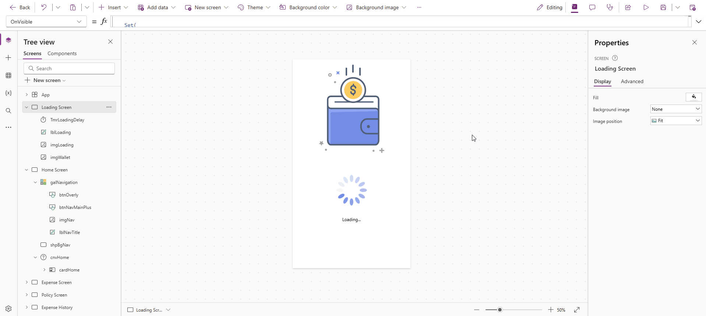

## 💵 Expenses App – Power Apps + Approval Flow

This mobile-friendly **Power Apps application** allows employees to **log, categorize, and submit business expenses** for manager approval. The app supports common use cases such as travel, internet, and meal reimbursements, and integrates with Power Automate for approval routing.

---

### ✨ Key Features

- 📱 **Mobile-ready UI** with modern design and intuitive navigation
- 🧾 **Expense logging by category**, with icon-based quick templates (Travel, Internet, Lunch, etc.)
- 📈 **Monthly spending trend line** to visualize user behavior over time
- ⚙️ **Power Automate integration** for submitting expenses for approval
- 💜 **User-specific data filtering** using `User().Email`
- 💡 Dynamic card-style layout for clean expense previews with date, tags, and amounts

---

### 🧠 Built With

- **Power Apps** for front-end UI and logic
- **SharePoint list** as the data source
- **Power Automate flow** for sending approval emails to managers
- `User().Email` to personalize and secure the app per user

---

### 📌 Use Case

Ideal for small teams, departments, or organizations without formal expense tools. Employees can submit expenses on the go, and managers receive structured, standardized requests through automated approval workflows.

---
