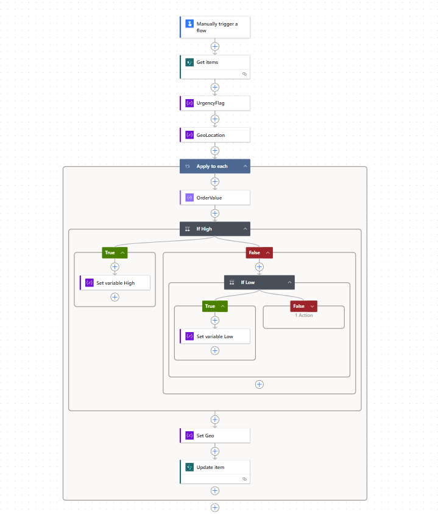
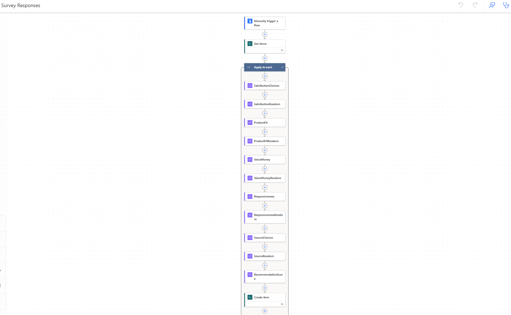

# 🌍 Global Sales Analysis Dashboard

This project showcases a scalable Power BI solution to analyze **global sales performance** across online and in-store channels. It integrates KPIs, geospatial insights, return behavior, and survey feedback — all powered by simulated ERP and survey data automated via Power Automate.

---

## ⚙️ Technical Summary

- **Data Sources**: Mock ERP data generated via SharePoint Lists and Power Automate; survey feedback collected through Microsoft Forms and stored in SharePoint
- **Data Modeling**:
  - Star schema with fact tables: `Sales_Orders`, `Survey_Responses`
  - Dimensional tables: `Date`, `Location`, `Product`, `Channel`, `Target_2025`
  - Relationships managed via Order ID, Product, and Date
- **Power Query**:
  - Combined order, discount, and return logic
  - Normalized date types, percent formats, and location fields
- **DAX Measures**:
  - `Net Sales`, `YTD Sales`, `Return Rate`, `Sales vs Target`
  - Channel breakdowns: `% Online Sales`, `% In-Store Sales`
  - LY comparisons using `SAMEPERIODLASTYEAR` and dynamic % change logic
- **Automated Flow Simulation** (Power Automate):
  - Order creation simulation
  - Urgency flag logic based on high-value orders
  - Triggered survey dispatch after online purchases
- **UX Enhancements**:
  - Custom cards with dynamic labels
  - Dark theme layout for executive consumption
  - Mobile-optimized version
    
---

## Dashboard Pages
### **Global Sales Analysis**

> Tracks channel performance, revenue growth, and progress toward quarterly targets.

**Visuals**:
- KPI Cards: `YTD Net Sales`, `Return Rate`, `Sales vs Target`
- Donut Chart: Online vs In-Store split
- Area Chart: Net Sales trend by channel
- Horizontal Bar: Country-level order volume
- Line Chart: Net Sales vs Total Discounts
- Azure Maps: Global sales footprint
- Card with % progress toward current quarter target

**Built With**:
- Date table for YTD and time intelligence
- DAX: `Sales LY`, `% Change`, `Return Rate = Returned ÷ Total`
- Geo-coding from `Location` dimension
- Custom card visuals using `UNICHAR(160)` and `UNICHAR(8195)` for spacing

---

## ⚙️ How to Use This Report

1. **Open `Global_Sales_Analysis.pbix` in Power BI Desktop**

2. **Load the following mock data tables**:
   - `Sales_Orders`: main transactional data
   - `Target_2025`: quarterly targets by continent

3. **Review and update core DAX measures**:
   - `Total Sales`, `Net Sales`, `Sales CQ`
   - `% Online Sales`, `% In-Store Sales`
   - `Sales vs Target`, `Return Rate %`, `Sales LY`

4. **Use slicers** to dynamically filter:
   - Continent
   - Date range
   - Sales Channel (Online vs. In-Store)

5. **Hover over tooltips** for additional insights

6. **Optional**: Publish to Power BI Service to share with others or embed into a website/report

---

## 📝 Survey Results Page – Voice of the Customer

This page captures and visualizes feedback from customers based on survey responses collected through **Microsoft Forms** and stored in a **SharePoint List**, with automation powered by **Power Automate**.

> Visualizes customer sentiment data linked directly to sales and products.

---

**Data Join**:
- Linked `Survey_Responses` to `Sales_Orders` via `Order ID`
- Enabled geographic and product-level sentiment breakdowns

**Visuals**:
- % Online Orders with Survey (dynamic KPI)
- Donuts: Satisfaction and Value Perception
- Bar: Feedback Source (Social, Friends, Search)
- Scatter: % Satisfied vs Order Value
- Country Ranking Table: Avg. Recommendation Score
- Product Sentiment Table: Avg Score, Qty Sold, Flags

**Tech Highlights**:
- DAX: `SELECTCOLUMNS`, `FILTER`, `IN` for linking responses
- Unicode-based KPIs with arrows and dynamic labels
- Conditional formatting on tables (red arrows for low sentiment)
- SharePoint integration for live survey ingestion

---

## 🛠 Techniques Used

- DAX for KPIs, comparisons, flags, and YoY logic
- Time intelligence via calendar table and custom measures
- Power Query transformations and table joins
- Geo-visualization using Azure Maps
- Power Automate to simulate data workflows and trigger responses
- Advanced formatting: Unicode in KPIs, dynamic titles, slicer interactivity

---

## 📁 Repository Contents

- `Global_Sales_Analysis.pbix` – full report file
- `/media` – preview images and GIFs
- Mock datasets: `Sales_Orders.xlsx`, `Survey_Responses.xlsx`, `Target_2025.xlsx`
- Documentation on Power Automate and SharePoint setup

---

## 📈 Business Impact Simulation

This project simulates a realistic business scenario with integrated reporting and workflow:

- **Track performance by region, product, and channel**
- **Align sales with quarterly targets across continents**
- **Measure and act on customer satisfaction trends**
- **Understand the real impact of discounts and returns**
- **Automate survey flows and connect feedback to sales**

---
## ⭐ .GIF

---

### 🛝 Basic Power Automate Flows used for mock data collection

