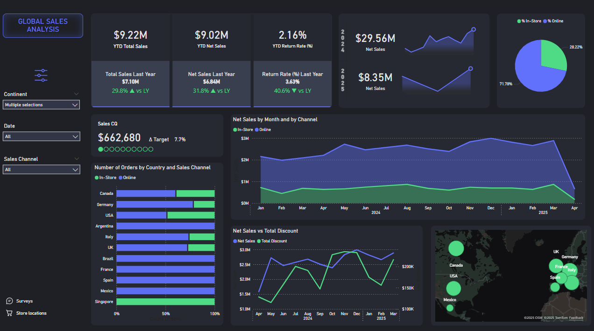
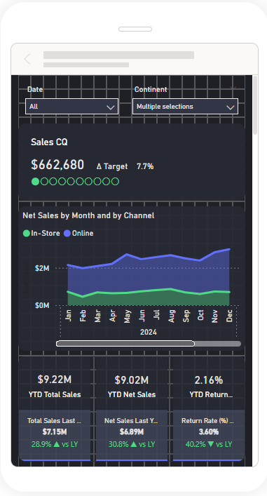
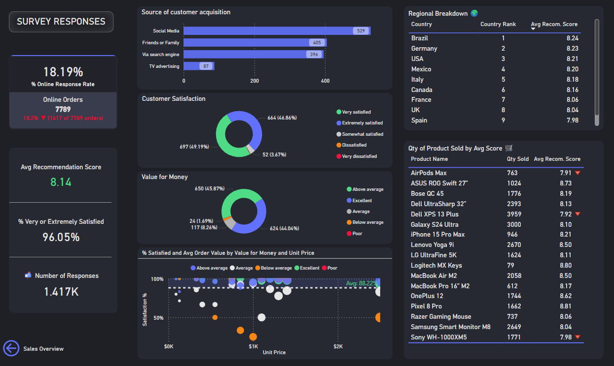

# 🌍 Global Sales Analysis Dashboard

This Power BI report visualizes and compares **online vs. in-store sales performance** across different countries and continents. It integrates KPIs, trendlines, geographical insights, and return rate analytics to help stakeholders understand global sales activity and performance against targets.

---

## 📊 Key Features

- 🌙 Dark theme executive dashboard
- 🛍️ Sales channel comparison (Online vs. In-Store)
- 📈 Year-over-year tracking for Net Sales and Return Rate
- 🎯 Performance vs. Quarterly Targets
- 🔎 Dynamic filtering by Continent, Date, and Channel
- 🌍 Geographical map of sales locations
- 📉 Sales vs. Discount trends (dual-axis chart)
- 🎨 Modern layout and clean UI
- 📱 Mobile version 

---

## 📁 Dataset Overview

Simulated data includes over 1,000+ records across 2 years, covering:

- Orders placed via online and in-store channels
- Product discounts, quantities, and returns
- Country, region, and continent location data
- Quarterly and yearly sales targets

🔁 Data Source Simulation (ERP + Workflow)
This dashboard was built using simulated ERP data generated and managed through:
- 📋 SharePoint Lists – representing the ERP system's order and target records
- 🤖 Power Automate flows – automating:
  - Order generation
  - Flagging of urgent or high-value orders
  - Triggering survey forms (MS Forms)
  - Pushing updates to downstream Power BI datasets

These components allowed realistic end-to-end business flow simulation, from order entry to real-time reporting — perfect for showcasing automation, analytics, and dashboarding all in one project.

---

## 💡 Insights Delivered

- Trends in online vs. in-store sales performance
- Progress toward quarterly and annual targets
- Return rate behavior compared to last year
- Top-performing countries by order count and revenue
- Global footprint visualized using Azure Maps
- Discount impact on net sales over time

---

### **Global Sales Analysis**

- 🔹 KPIs: YTD Sales, Net Sales, Return Rate
- 🔹 % Change vs. Last Year (color-coded)
- 🔹 Donut Chart: % of Online vs. In-Store Sales
- 🔹 Line/Area Chart: Net Sales by Month and Channel
- 🔹 Horizontal Bar: Orders by Country and Channel
- 🔹 Line Chart: Net Sales vs. Total Discounts
- 🔹 Card: Current Quarter Sales vs. Target (with %)
- 🔹 Map: Sales intensity and store locations

---

## ⚙️ How to Use This Report

1. **Open `Global_Sales_Analysis.pbix` in Power BI Desktop**

2. **Load the following mock data tables**:
   - `Sales_Orders`: main transactional data
   - `Target_2025`: quarterly targets by continent

3. **Review and update core DAX measures**:
   - `Total Sales`, `Net Sales`, `Sales CQ`
   - `% Online Sales`, `% In-Store Sales`
   - `Sales vs Target`, `Return Rate %`, `Sales LY`

4. **Use slicers** to dynamically filter:
   - Continent
   - Date range
   - Sales Channel (Online vs. In-Store)

5. **Hover over tooltips** for additional insights

6. **Optional**: Publish to Power BI Service to share with others or embed into a website/report

---

## 🧪 Techniques Used

- DAX: moving average, % of total, year-over-year growth
- Layout design with balance and dark theme polish
- Custom card visuals using `UNICHAR(160)` and `UNICHAR(8195)` for spacing
- Tooltip configuration and slicer interactivity
- Geo-visualization using Azure Maps

---

## 🚀 Skills Demonstrated

- Power BI report building and storytelling
- KPI design and dynamic target tracking
- Sales performance analysis
- Visual best practices for executive dashboards
- Time-based trend comparison
- Channel performance analysis

## 📝 Survey Results Page – Voice of the Customer

This page captures and visualizes feedback from customers based on survey responses collected through **Microsoft Forms** and stored in a **SharePoint List**, with automation powered by **Power Automate**.

The goal is to provide a **holistic view of customer sentiment** by linking feedback directly to sales performance, orders, and products.

---

### 🎯 Key Features

- 🔁 **% Online Response Rate**  
  Displays the percentage of online orders that received a customer survey response, with a dynamic reference label showing the actual number of responses vs. orders. Colored indicators reflect thresholds (e.g., red if <70%).

- 🌟 **Customer Satisfaction + Value for Money**  
  Two donut charts break down customer ratings by satisfaction level and perceived value, clearly showing proportions of very/extremely satisfied customers.

- 💬 **Source of Feedback**  
  A horizontal bar chart showing where customers heard about the company (e.g., Social Media, Friends, Search).

- 📈 **% Satisfied vs. Order Value**  
  A scatter chart comparing satisfaction levels, unit price, and value-for-money perception — revealing hidden insights into customer perception based on price tiers.

- 🗺️ **Country Ranking**  
  A ranked table of countries based on average recommendation score, pulled using a relationship between `Survey_Responses` and `All_Sales` via `Order ID`.

- 🛍️ **Product-Level Satisfaction**  
  Table comparing average recommendation score and quantity sold across top products. Downward-pointing red arrows help flag products with underperforming sentiment.

- 📊 **Survey KPIs**  
  - **Average Recommendation Score**  
  - **% Very or Extremely Satisfied**  
  - **Total Number of Responses**

---

### 🧠 Techniques Used

- Complex DAX logic using `FILTER`, `SELECTCOLUMNS`, and `IN` to match survey responses to online orders  
- Unicode formatting (`UNICHAR`) for custom card reference labels (with arrows and dynamic colors)  
- Relationships between `Survey_Responses` and `All_Sales` via `Order ID` to enable geographic and product analysis  
- Conditional formatting for flags and arrows  
- Modern layout with donut charts, scatter visuals, KPI cards, and sleek dark theme

---

### 📌 Business Value

This page turns raw survey data into **actionable business insights**, allowing the company to:

- Identify satisfaction trends by product and region  
- Spot underperforming customer experiences early  
- Optimize marketing strategies based on source attribution  
- Align product pricing and value perceptions
