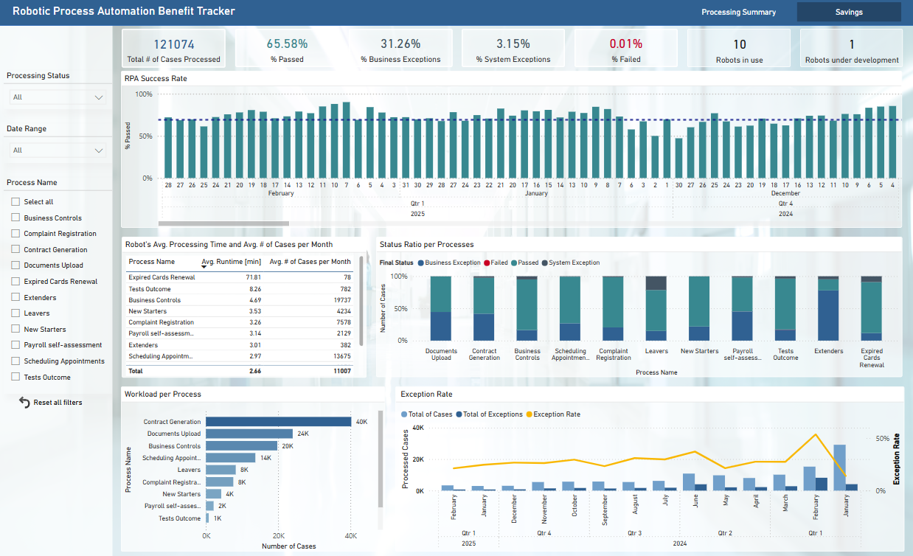
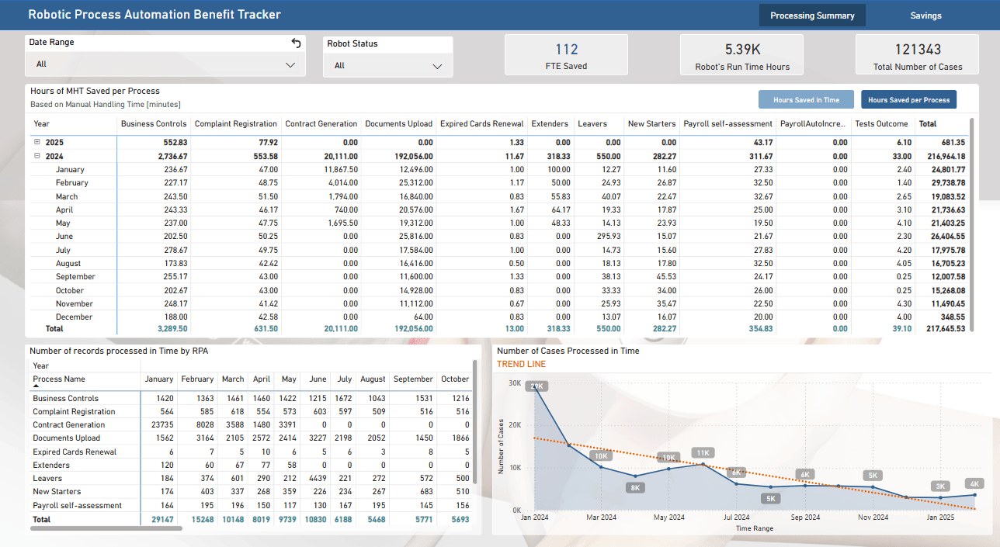

# 📊 RPA Automation Performance Dashboard

## 📂 **Introduction**

**Report Goal:** This Power BI dashboard monitors the performance of robotic process automation (RPA) within a company. It provides insights into the efficiency and effectiveness of automated processes by tracking execution metrics, errors, and FTE savings.

**Use Case:** This report is designed for **operations managers**, **automation teams**, and **business decision-makers** to evaluate the impact of automation, identify process inefficiencies, and assess FTE savings.

---

## 📚 Data Description

- **Data Source:** SharePoint (logs from RPA runs)
- **Key Columns and Measures:**
  - `Process_Name` - The name of the automated process
  - `RunTime_Hours` - The number of robot activity hours
  - `Items_Count` - The number of transactions completed
  - `Final_Status` - Case processing outcome indicator
  - `% System_Exceptions` - Count of system-related exceptions
  - `% Business_Exceptions` - Count of business rule exceptions
  - `% Failed_Runs` - Number of unsuccessful automation attempts
  - `Manual_Handling_Time` - Time required for manual processing before automation
  - `Hours_Saved` - Estimated cost savings due to automation
  - `FTE_Saved` - Estimated FTE savings due to automation

---

## 📊 Key Visualizations

### 📅 Main Dashboard

This dashboard provides an overview of RPA performance, including the number processed cases, exception rates, and status ratio between processes.

### 🔄 Filters and Interactivity

Users can filter data by:
- **Process Name** – View performance metrics for individual automated processes
- **Date Range** – Analyze automation trends over specific time ranges

### 📊 Savings Analysis

This visualization presents the estimated savings of manual work - by Process Name **or** by Time. Based on this, Manager is able to calculate concrete financial savings.

---

## 📊 Summary

- **What does the report show?** The dashboard provides insights into RPA efficiency, reliability, and impact on business operations.
- **What problems does it solve?** It helps stakeholders assess automation performance, identify high-exception processes, and measure cost reductions.
- **What could be improved?** Future enhancements could include real-time data updates and direct integration with the automation tool.
---
