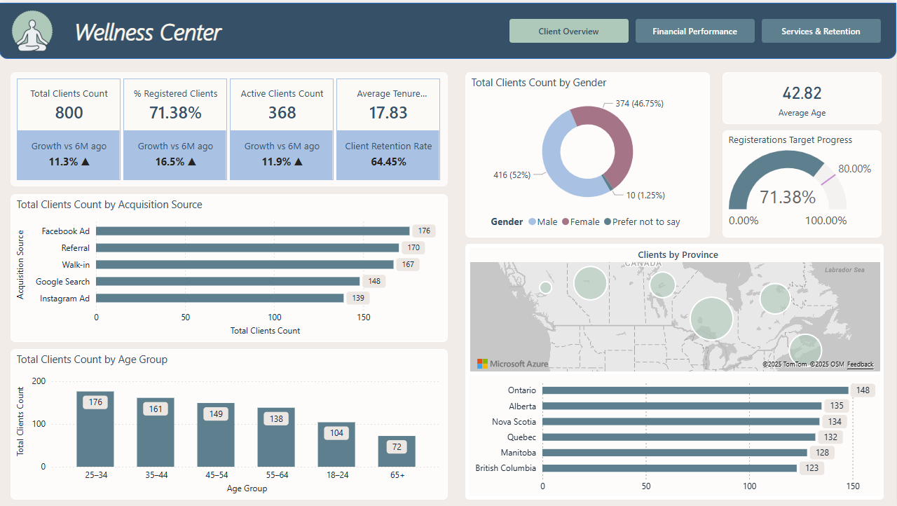
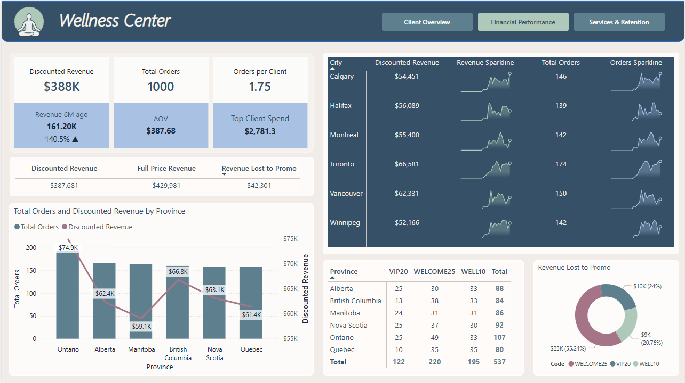
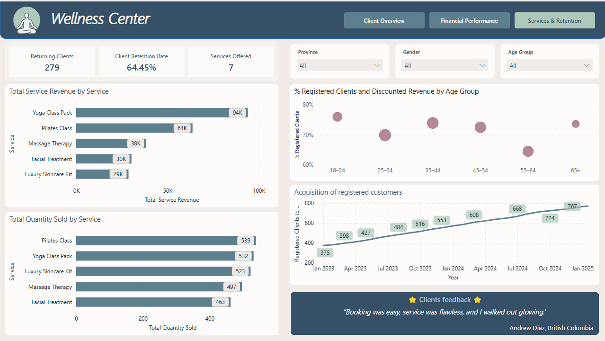
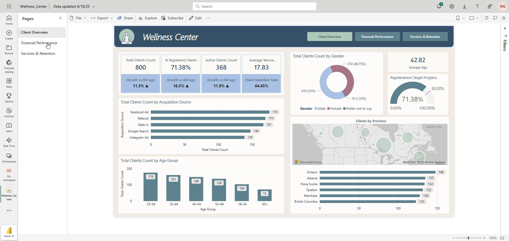

# 🌿 Wellness Center – Power BI Dashboard

This Power BI solution analyzes customer engagement, service performance, and revenue trends for a luxury wellness center. It integrates financial, operational, and feedback data to support business decisions across marketing, finance, and operations — all wrapped in a clean, spa-inspired UI.

---
## ⚙️ Technical Summary
- **Data Integration**: Combined client registration, order, location, and survey data into a unified Power BI model.
- **Data Preparation**: Cleaned and transformed in Power Query — standardized formats, calculated age and tenure, reshaped promo codes and locations
- **Data Modeling**: Used a star schema with relationships between Clients, Orders, Services, Promos, and Locations; linked date fields for time-based analysis
- **DAX Highlights**:
  - Client Retention Rate
  - Discounted Revenue and Average Order Value (AOV)
  - Total Orders and % Registered Clients
  - Custom sparklines using `data:image/svg+xml` for inline trend visuals
- **Advanced Visuals**: Combo charts, bubble matrix, KPI cards, donut charts, and testimonial carousel
- **Business Focus**:
  - Measured marketing impact via acquisition source tracking
  - Analyzed revenue by service and region to identify top performers
  - Compared registration engagement by demographic group
    
---

## Dashboard Pages

### 🧘🏼‍♀️ 1. Client Overview

Understand who your clients are and how they’re engaging.

**Visuals**:
- Client demographic distribution (age, gender)
- Acquisition channels (Google, Facebook, Walk-in)
- Map and bar chart: Clients by province and city
- KPI cards: Total Clients, % Registered, Avg. Tenure

**Behind the Scenes**:
- Calculated columns: Age, Tenure, Registration Flag
- Power Query cleanup of inconsistent acquisition data
- Retention Rate = `DIVIDE(Returning Clients, Total Clients)`

📌 *Used to shape marketing strategies, onboarding efforts, and regional expansion decisions.*

---

### 💰 2. Financial Performance

Track revenue trends, discount impact, and regional performance.

**Visuals**:
- **Revenue and Orders by City**: With sparklines to highlight performance trends
- **Discounted vs Full Price Revenue**: Understand revenue impact of promotions
- **Promo Code Breakdown**: Table and donut chart showing how each promo performed (WELCOME25, VIP20, WELL10)
- **Orders and Revenue by Province**: Dual-axis combo chart to align sales with region
- **Revenue Lost to Promo**: Quick visual of how much was “given away” through discounts

📌 *Equips finance and marketing teams with data to balance growth incentives and profitability.*

---

### 🌿 3. Services & Retention

Explore what keeps clients coming back.

**Visuals**:
- **Total Revenue & Quantity by Service**: Shows which offerings bring in the most revenue and volume
- **% Registered Clients vs Discounted Revenue by Age Group**: Bubble chart blending client engagement and profitability
- **Client Acquisition Trend**: Line chart visualizing growth in registered clients over time
- **Client Quote**: Carousel with real-like testimonials for added human touch

**Built With**:
- Age groups binned in DAX
- Service table linked via Service ID for breakdown
- Testimonial text randomly rotated per page view

📌 *Supports product decisions, pricing refinement, and loyalty program strategies.*

  
---
### ⭐ .GIF

## 🧩 Tools Used

- Power BI (Data model, DAX, visuals)
- Power Query (Data transformation & cleanup)
- Excel (Mock ERP & survey source data)
- SVG (Sparklines inside table visuals)

---

## 📁 Included in Repository

- `WellnessCenterDashboard.pbix`
- `/media` folder with preview images and walkthrough `.gif`
- Custom Power BI theme file (`theme.json`)
- README documentation (this file)

---

## 🧠 Key Takeaways

This dashboard demonstrates:

- Data modeling with fact-dim structure
- Practical DAX for business KPIs
- Creative UX and visualization storytelling
- A well-scoped, end-to-end reporting solution from data to insight

---
